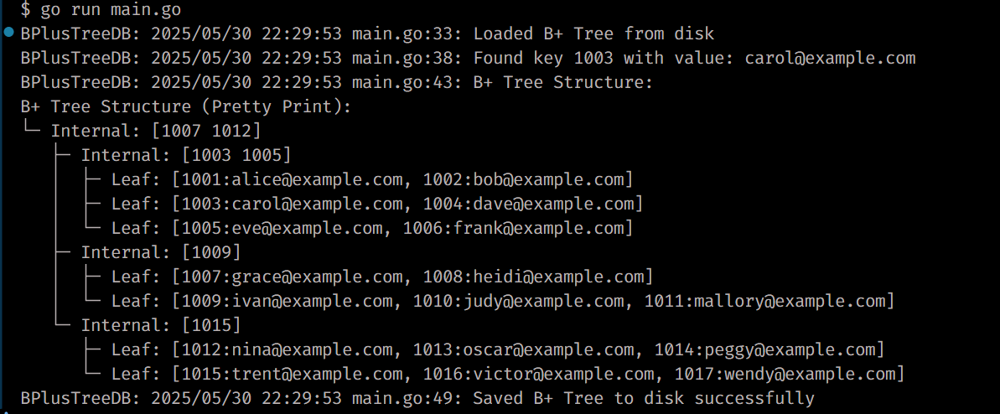

# B+ Tree Database Indexing in Go


## Overview

This project implements a **B+ Tree** data structure in Go, designed to mimic multi-level indexing commonly used in database systems for efficient key-value storage and retrieval. It supports insertion, search, range queries, and deletion with node merging to maintain balance.

The B+ Tree is persisted to disk using Go's `gob` encoding, enabling data persistence across program restarts. This project serves as both a learning tool for database indexing concepts and a foundation for building lightweight on-disk key-value stores.

<table align="center" style="border: 2px solid white; border-collapse: collapse; width: 100%;">
    <tr>
        <td style="border: 2px solid white; padding: 8px; background: #222; text-align: center;">
            <br>
        </td>
    </tr>
    <tr>
        <td style="border: 2px solid white; padding: 8px; background: #222; text-align: center;">
            <br>
        </td>
    </tr>
</table>

## How to Use

### Prerequisites

- Go 1.20+ installed

### Clone and Run

```bash
    git clone https://github.com/Prayag2003/b-plus-tree-database-indexing.git
    cd b-plus-tree-database-indexing
    go run main.go
````

---

## Theory: What is a B+ Tree?

A **B+ Tree** is a self-balancing tree data structure widely used in databases and file systems. It maintains sorted data and allows searches, sequential access, insertions, and deletions in logarithmic time.

Key properties:

- Internal nodes only store keys (no actual data), acting as guides to locate leaves.
- Leaf nodes store actual key-value pairs.
- Leaf nodes are linked sequentially, enabling efficient range queries.
- Tree remains balanced by splitting or merging nodes when they overflow or underflow.
- The tree order (`m`) defines the max children per internal node and max keys per leaf node.

**Why B+ Tree for databases?**

- Efficient multi-level indexing for fast lookups.
- Supports range scans easily.
- Minimizes disk I/O by maximizing node occupancy.
- Maintains balance automatically during updates.

---

## Implementation Details

### 1. Configuration

- `config/config.go` defines tree order (`m`) and storage path for persistence.
- Easily adjustable for different B+ Tree degrees and data file locations.

### 2. Data Persistence

- `data/storage.go` uses Go's `encoding/gob` to serialize and deserialize the entire B+ Tree struct.
- Registers concrete node types to enable proper decoding.
- Automatically loads existing tree on startup or creates a new one if none exists.

### 3. B+ Tree Core

- Nodes implemented as `InternalNode` (keys + children) and `LeafNode` (keys + values + linked list pointer).
- `BPlusTree` struct maintains root pointer and tree order.
- Supports:
  - **Insertion** with node splitting.
  - **Search** by key.
  - **Range Search** returning all key-value pairs in a key range.
  - **Deletion** with node merging and redistribution to maintain balance.
- Pretty print function visualizes the multi-level tree structure.

### 4. Sample Data

- `data/emails.go` provides example user IDs mapped to emails to demonstrate practical use.

### 5. Application Flow (main.go)

- Loads config.
- Attempts to load B+ Tree from disk; inserts initial data if none found.
- Performs sample searches.
- Prints the tree structure.
- Saves the tree back to disk after operations.
- Logs key actions for transparency and debugging.

---


## Potential Improvements & Next Steps

* Implement concurrency safety with mutexes for parallel access.
* Add more complex data types and composite keys.
* Develop a command-line interface (CLI) or web API for interacting with the tree.
* Support bulk loading for large datasets.
* Benchmark performance for large-scale scenarios.
* Add unit and integration tests for reliability.
* Explore alternative serialization formats (e.g., protobuf).
* Integrate with actual database or file system to serve as a lightweight index.
